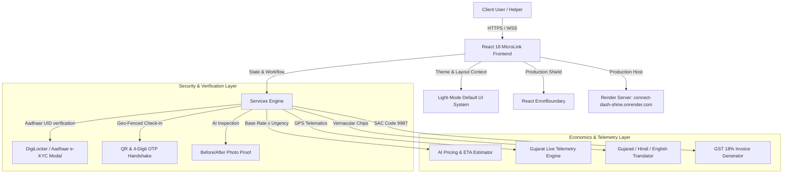

# 📚 MicroLink Technical System Documentation

## 1. Executive System Summary & Production Endpoints
MicroLink is a hyper-local micro-gig service platform engineered for high concurrency, low latency, and physical verification across India & Gujarat.

- **Primary Production Server URL**: [https://connect-dash-shine.onrender.com](https://connect-dash-shine.onrender.com/)
- **GitHub Repository**: [https://github.com/12402040601079-hub/connect-dash-shine.git](https://github.com/12402040601079-hub/connect-dash-shine.git)

---

## 2. Architecture & Data Flow



---

## 3. Core Modules & Component Architecture

### A. Security & Verification Engine (`src/components/workflow/`)
1. **`AadhaarKycModal.tsx`**:
   - Manages DigiLocker Aadhaar UID verification state.
   - Validates 12-digit UID syntax, sends simulated 6-digit OTP, updates user profile state, and badges profile with `isAadhaarVerified: true`.
2. **`GeoQrHandshakeModal.tsx`**:
   - Renders SVG QR code + 4-digit numeric OTP.
   - Validates latitude/longitude proximity (haversine formula <= 0.05 km) before job execution.
3. **`AiWorkProofModal.tsx`**:
   - Accepts image uploads for pre-work and post-work conditions.
   - Runs heuristic AI vision checks and approves escrow payout.

### B. Smart AI Dispatch & Pricing (`src/services/aiEstimator.ts`)
Calculates real-time gig costs:
```typescript
interface EstimateParams {
  category: string;
  urgency: 'low' | 'standard' | 'high' | 'urgent';
  distanceKm: number;
  weatherCondition?: 'clear' | 'rain' | 'extreme_heat';
  hasGigInsurance?: boolean;
}
```
Formula:
$$\text{Total Fare} = (\text{Base Rate} + \text{Distance} \times 12) \times \text{Urgency Multiplier} + \text{Insurance Addon}$$

### C. Gujarat Telemetry & Emergency Safety (`src/components/workflow/LiveTrackingMap.tsx`)
- Animated Leaflet/OpenStreetMap wrapper tracking helper routes between Ahmedabad, Gandhinagar, Surat, Vadodara, Rajkot, and Bhavnagar.
- Includes 1-click WhatsApp SOS button generating pre-filled emergency links:
  `https://wa.me/?text=EMERGENCY%20SOS%20Live%20Location:...`

### D. GST Tax Invoicing (`src/services/invoice.ts`)
Computes Indian GST breakdowns:
- **SAC Code**: 9987 (Maintenance, Repair & Micro-Services)
- **CGST**: 9%
- **SGST**: 9%
- Generates clean, printable HTML/PDF receipts.

---

## 4. Error Handling & High-Traffic Shield (`src/components/ErrorBoundary.tsx`)
- Wraps the top-level application root.
- Intercepts uncaught runtime JS/React errors without crashing the browser tab.
- Offers **Refresh Session** and **Reset Safe State** actions.

---

## 5. Security & Secret Protection Protocol
- `.env` is listed in `.gitignore` and removed from git cache.
- Credentials remain on local machine/server only.
- Developers must populate local environment parameters using `.env.example`.

---

## 6. Build & Maintenance Commands

```bash
# Check TypeScript Types
npx tsc --noEmit

# Run Local Dev Server
npm run dev

# Compile Production Distribution Bundle
npm run build

# Preview Production Build locally
npm run preview
```
